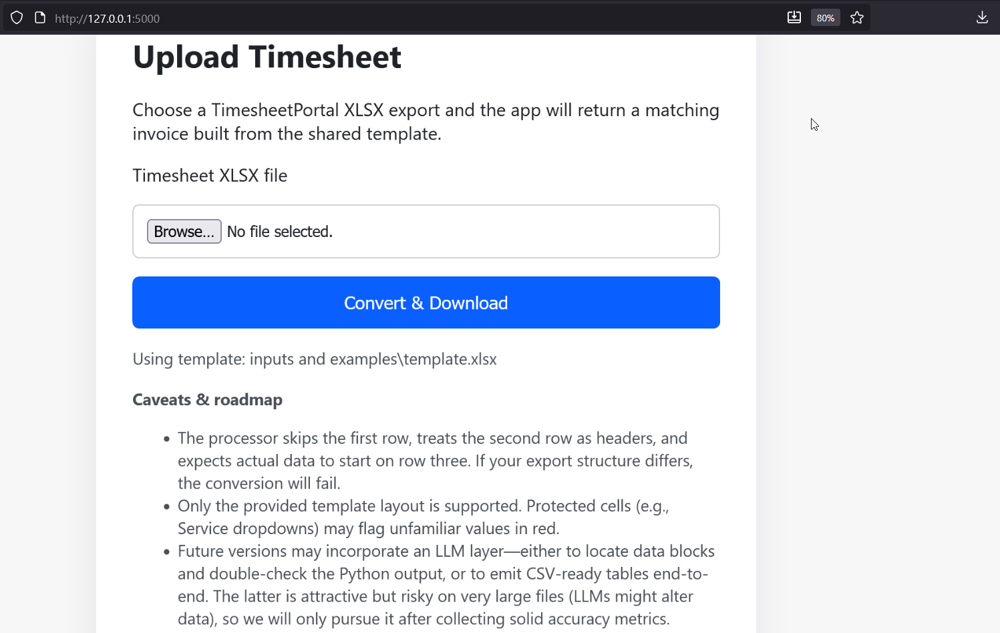
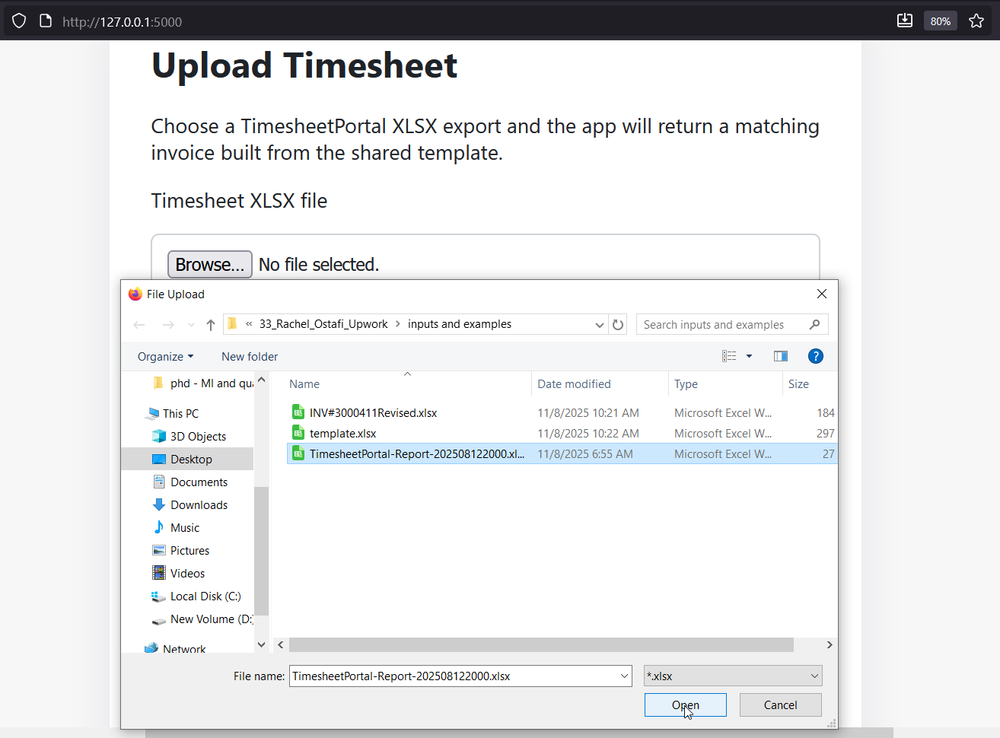
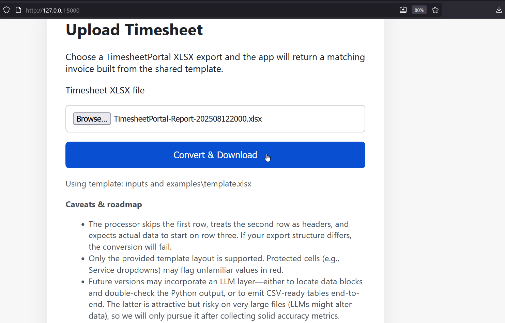
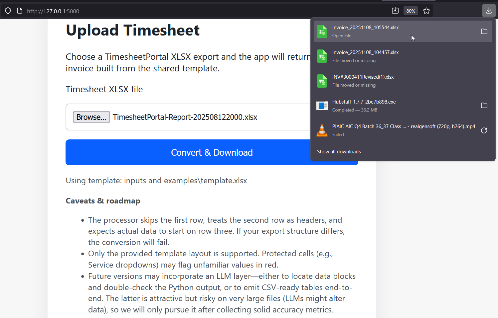

Timesheet -> Invoice Converter
==============================

<p align="center">
  
  
</p>
<p align="center">
  
  
</p>
<p align="center"><sub>Adjust each <code>width</code> attribute to control the display size.</sub></p>

This project is a “digital assistant” that takes the messy Timesheet Portal spreadsheet, tidies it up, and lays the numbers neatly into the Therapy Source invoice template. It quietly reads each row, pulls out who the therapist was, which student they saw, how long the session lasted, and any other key details, then drops everything into the right invoice columns so the finished file is ready to submit. Under the hood it’s just Python with the pandas and openpyxl libraries—no AI tricks—so it stays predictable, fast, and affordable to run.

Project layout
--------------

- `inputs and examples/TimesheetPortal-Report-*.xlsx` – sample raw exports.
- `inputs and examples/template.xlsx` – the invoice template that receives the transformed rows.
- `output/` – destination for the generated invoices (created automatically).
- `scripts/timesheet_agent.py` – the converter script.
- `app.py` / `templates/` – optional Flask web app for browser-based uploads.

What the script does
--------------------

1. Opens the Timesheet Portal file, ignores the decorative header line, and starts reading the actual table.
2. For each row it grabs the therapist, date, service, and session hours, plus it gently splits the Activity Description into the student’s name and their PA Cyber ID.
3. It converts the hours into minutes (because the invoice wants minutes) and keeps everything in the right order.
4. Finally it copies the invoice template, pastes the refreshed data into row 7 onward, and leaves the styling exactly as Finance expects.
5. Two columns stay blank on purpose:
   - `Contracted Rate` per the project brief.
   - `Travel for Therapy (Y/N)` because the source export does not provide that information.

About the protected Service column
----------------------------------

Column `E` in the template uses locked cells and a dropdown list. When the script pastes values that are not present in the dropdown, Excel highlights them in red. This is expected unless:

1. You unprotect the column/remove the validation rule in the template before running the script, **or**
2. You provide a definitive mapping list (e.g., "SLP Eval" -> "Speech and Language Pathology") so the script can convert every service label to one of the approved dropdown entries.

Getting started
---------------

1. Install [uv](https://github.com/astral-sh/uv) if it is not already available.
2. From the repo root run:

   ```
   uv sync
   ```

   This creates the virtual environment and installs pandas and openpyxl.

Running the converter (uv workflow)
-----------------------------------

Point the script at your input, template, and desired output path:

```
uv run python scripts/timesheet_agent.py ^
    --source "inputs and examples/TimesheetPortal-Report-202508122000.xlsx" ^
    --template "inputs and examples/template.xlsx" ^
    --output output/Invoice_All_Therapists_July2025.xlsx
```

(On macOS/Linux replace the PowerShell line breaks with `\`.)

- `--source` : the Timesheet Portal export to convert.
- `--template` : the invoice template copy to populate (it remains untouched; a copy is written to `--output`).
- `--output` : path to the finished invoice workbook.

After the command completes, open the file in `output/` to confirm the data and formatting. When you are ready to automate further (e.g., add validation, upload logic, or an LLM agent), you can build on top of this pandas/openpyxl foundation without changing the existing inputs.

Running without uv
------------------

If you prefer the standard Python toolchain:

1. Create and activate a virtual environment:

   ```
   python -m venv .venv
   .venv\Scripts\activate    # macOS/Linux: source .venv/bin/activate
   ```

2. Install dependencies:

   ```
   pip install -r requirements.txt
   ```

3. Run the converter:

   ```
   python scripts/timesheet_agent.py ^
       --source "inputs and examples/TimesheetPortal-Report-202508122000.xlsx" ^
       --template "inputs and examples/template.xlsx" ^
       --output output/Invoice_All_Therapists_July2025.xlsx
   ```

   (Use `\` for line breaks on macOS/Linux.)

Caveats & future direction
--------------------------

- **Rigid input layout:** The script skips row 1, uses row 2 as headers, and expects data to begin on row 3. If a TimesheetPortal export deviates from that order (extra header rows, blank bands, etc.), the converter will raise an error rather than guess.
- **Template-bound output:** Only `inputs and examples/template.xlsx` is supported. Cells such as the Service column remain protected, so values not listed in the built-in dropdown may display in red unless you remove protection or provide a mapping between abbreviations (e.g., “SLP Eval”) and approved labels.
- **Intentional blanks:** `Contracted Rate` stays empty per the instructions, and `Travel for Therapy (Y/N)` is blank because the source export does not expose that information.
- **LLM roadmap:** Future releases may add an LLM layer: first to detect the real data range and double-check Python’s output, and later (optionally) to produce CSV-formatted tables we convert straight to Excel. That second approach is powerful but risky with very large files because LLMs can subtly alter data, so we will only ship it after measuring accuracy with clear acceptance metrics.

Web app (optional)
------------------

Prefer a simple UI instead of the CLI? Start the Flask app and upload files through the browser.

- **With uv**

  ```
  uv run flask --app app run --debug
  ```

- **With a plain Python env**

  ```
  flask --app app run --debug
  ```

- **With Docker**

  ```
  docker build -t timesheet-app .
  docker run -p 5000:5000 timesheet-app
  ```

Then open `http://127.0.0.1:5000/`, choose your TimesheetPortal export, and the app will return a converted invoice based on `inputs and examples/template.xlsx`. The same data rules apply (blank Contracted Rate & Travel columns, protected Service column behavior, etc.).
